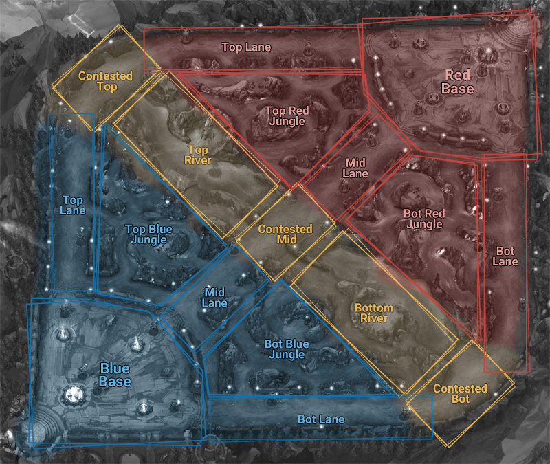

TechLabs Group 10

# Determining win percentage from draft phase in a professional League of Legends game
*"So many noobs, will matchmaking ever find balance?"* - Akali

1. [Introduction](#Introduction)
2. [Methods and Results](#Methods and Results)
    * [Level 1: Considering Champion Names](#Level1)
    * [Detailed Analysis of Data](#Detailed Analysis of Data)

    * [Level 2: Considering Win rates](#Level 2: Second Round of Prediction using ML: Considering Win rates)
    * [Level 3: Considering Champion Stats](#Level 3: Third Round of Prediction with ML/AI: Considering Champion Stats)

    * [Analysis of Most Played Champions and Champion Synergies](#Analysis of Most Played Champions and Champion Synergies)
    * [Level 4: Considering Synergy Scores](#Level 4: Fourth Round of Prediction with ML/AI: Considering Synergy Scores)
3. [Conclusion](#Conclusion)
4. [Outlook](#Outlook)

## Introduction

Our project with TechLabs deals with the idea of using data science and AI to predict the winner of the multiplayer game _League of Legends_.

We approach this task in a unique way: 
> **We are taking the players themselves and the initial performance within the game out of the equation and only consider how the _champions_ in both teams stack up against each other during the draft phase.**

We first introduce the game and explain the motivation behind this project. In the main section, we structured both our data analysis and machine learning results in levels. Finally we conclude on our results, and explain which questions and tasks could be tackled in the future. 

### Game Overview
League of Legends is a popular Multiplayer Online Battle Arena (MOBA) game. Since its initial release in 2009 it grew to have one of the largest gaming communities worldwide. With over 115 million monthly players, the relevancy of the game is undeniable. Its combination of high paced decision-making, real time strategy, critical thinking and flexibility makes it appealing to a lot of people who like to challenge themselves. Consequently, League of Legends is also represented in eSports where professional teams compete against each other with state of the art skills for the chance of winning high prizes and maintaining a successful career.

The game consists of 2 teams, red and blue, with 5 players each. In general there are 5 positions from which each player can choose and every single player selects a champion best suited for their position and the role tied to it. These roles are:
* Top lane, played on the top path of the map
* Mid lane, played on the middle path
* Bot lane, played on the bottom path
* Support, which initially is played on the bottom path  but later turns into a role that needs to support the whole team
* Jungler, played in the appropriately named jungle area which exists between the lanes

The gameplay is very dynamic and can get quite complex with different positional constellations, champion abilities and items. Needless to say that the potential is limitless. The goal of the game is to be the first to destroy the enemy's base called the Nexus. Along the way the player's champions will fight each other.

Each game starts with a draft phase in which both competing teams select and ban five champions each in a specific order (*as depicted in the image below*). The banned champions cannot be picked for the entire duration of the game. As of this analysis, 153 champions have been released with each champion having its own individual strengths and weaknesses. Choosing five champions wisely from this vast pool in the draft phase is one of the most crucial steps towards victory. Due to the selection order, the blue team always has the advantage to pick the first champion. Only after that can the red team select their first champion, with their advantage being the final counterpick. Consequently the blue team will drive the draft phase as the red team has to prioritize on counterpicking. 

The draft phase holds the potential of skewing the odds of a game before the actual match has even started. Therefore, our aim is to analyse how well we can predict the outcome of a game solely based on picking certain champion combinations. 

### Objectives
Our project aims to achieve the following objectives:

> * **Figure out if the blue or red side has a significant advantage right after draft phase.**
> * **Help players to analyze the picks after the match.**
> * **Determine how those picks influenced the game.**
> * **Determine how different attributes of a champion impact the draft.**
> * **Illustrate the importance of first picks, counterpicks and roles.**
> * **Evaluate how champions in a team synergize and what combinations of champions counter them.**

## Methods and Results

Before commencing with our project, we considered which platforms we should use. Since we lack the option to meet up in real life due to current Covid-19 measures, we decided to switch to Discord for our communication and temporary data transfers. Furthermore, we decided to use Jupyter Notebook for our code, as it facilitates data visualisation, is readily accessible and makes the data transfers easier. Finally, we set up a Git Repository (using GitHub) with our mentor, who also took the time to give us an introduction on the functionalities. 

### Tools and Libraries

The most relevant libraries we used working on this project are:
* **NumPy** and **Pandas** for the analysis of the data.
* **Matplotlib** and **Seaborn** for plotting the data.
* **Scikit learning** and **PyTorch** for machine learning and win prediction.

NumPy and Pandas are the most common libraries for data analysis. The NumPy library is the core library for scientific computing in Python. 

The Pandas library is built on NumPy and provides easy-to-use data structures and data analysis tools for Python. It was particularly easy to use and provided the right tools to analyse specific sections of data. For example, for analyzing one champion in more detail in one specific role, like Camille on Top, the data set can be sliced, so that only the rows where the champion played the specific role are shown.

With Matplotlib, a 2D plotting library, we were able to produce publication-quality figures for our analysis. Adding to that, Seaborn is a practical data visualization library which provided us with a high-level interface for drawing informative statistical graphics like heatmaps.

Moving on to the machine learning part, Scikit-learn provides simple and efficient tools for predictive data analysis. It was primarily used to deploy machine learning methods such as Decision Trees, Random Forests, Logistic Regression, Support Vector Machines and K-Nearest Neighbors. For neural networks and deep learning, PyTorch was our library of choice.

Furthermore, we joined the Riot Developers Discord to gain further insights on the game functionalites and data availability.

---
### Data Crawling and import
To analyse the draft phase, we required games to take place on a sufficiently high skill level so that other factors such as the players themselves would be balanced on both sides of the draft phase. As a result we decided that the average elo of a game has to be at least GrandMaster to be considered. Also since playstyles differ around various regions across the world, data from the most important servers was considered. Overall, for the Top 1000 players in a region, 10 games from each of the players were collected and any overlaps were deleted. In the end, we had a large enough database with close to 20k games in total. 

* **Parameters considered**: 	Name of the champion & the respective role in which they were played (5 roles on each side), Match Winner
* **Game Patch**: 10.25.1
* **Data Source**: op.gg
* **Crawling tool used**: Scrapy

Detailed information on how to go about crawling data can be found [here](https://medium.com/@_marcusft/how-i-created-a-league-of-legends-high-elo-database-using-scrapy-3becdee8f385)

---

### Data Cleaning and Analysis

Once the data had been verified for its accuracy and represented in a cleaner manner, the distribution of data was analysed. Initial conclusions were:

* Our database has approximately the same amount of blue side and red side wins i.e., the data is evenly distributed.

* The database contains all the 153 champions (at the time of analysis) in the game.

* Champion data was collected in a separate dataframe with their corresponding attributes. Please note that some champions had more than one role in which they were played. To simplify analysis and to process data in an efficient manner, only the two most-played roles for each champion were considered. 

---

### Level 1: Initial Prediction with ML: Considering Champion Names

For our initial analysis, only the champion names, their roles and the winning team were considered. The idea behind this was to find out how good Machine Learning algorithm predictions were for the simplest of attributes.

A figurative representation of an example with a team of 5 champions and the parameters considered are shown below: 

We will keep these 5 champions as reference when we go to the next levels in order for the reader to have a better grasp of the parameters considered at each level.

**ML methods considered**: *Decision Trees, Random Forests, Support Vector Machines*

The reasoning behind choosing Decision Trees and Random Forests is that both work really well segmenting the data using Yes/No answers to decision statements.

Support Vector Machines were also used to check whether our data could be separable in a higher dimensional space

**Results**: 

| Decision Trees | Random Forests | Support Vector Machines |
| -------- | -------- | -------- |
| 51%     | 52%     | 51%    |

**Insights**: 

Our simplest model yields an F1 score close to random chance suggesting that more parameters need to be considered.

---

### Detailed Analysis of Data
To construct a more involved model it was important to analyse the data set at hand, which initially consisted of around 20k played games. 

Due to the fixed picking order during the draft phase, the first hypothesis is that the blue team has a significant advantage, because they can select the first and therefore strongest champion of the particular patch/season. Since the number of games played on each of the 153 champions was different, the normalized average for each of the five roles was taken. Even though the difference is only up to about 1%, it turned out to be a consistent difference between the blue and red team. 

While this difference is not large enough to conclude that the blue side has a significant advantage, it lead to more research on whether champions perform better on the blue team. Thus, from external analysis that were previously made on the game, we learned that developers struggled for a long time to balance out the blue and the red side. Even though the red team was given the advantage of counterpicking the selected champions of the blue team, various aspects of the map favor the blue side. One of the biggest imbalances is the camera angle, which gives teams on the red side a shorter vision range to the bottom (85% down vs. 145% up). 

[Source](https://www.unrankedsmurfs.com/blog/lol-blue-side-advantage)

---

### Level 2: Second Round of Prediction using ML: Considering Win rates
This time around instead of using Champion Names, we replaced them with their corresponding win rates in the particular role they played in.

**ML methods considered**: *Decision Trees, Random Forests, Support Vector Machines, K-Nearest Neighbors, Logistic Regression*

In addition to previous models, Logistic Regression and K-Nearest Neighbors were added this time.

K-Nearest Neighbors and Logistic Regression were chosen considering now that our parameters comprise regression values. K-Nearest Neighbors is applicable here especially considering the fact that all the champion win rates are already normalised (since percentage values range between 0 and 100) 

**Results**: 

| Decision Trees | Random Forests | SVM | K-NN | Logistic Regression |
|:--------------:|:--------------:|:---:|:----:|:-------------------:|
|      52%       |      54%       | 56% | 55%  |         57%         |

**Insights**: 

On average we see a 5% increase in our prediction rates when the champion win rates were considered. Why does this happen? It can be deduced that the increase in prediction rate is due to the fact that instead of just considering the raw win rate of a champion on a particular side, their predominant role win rates were also considered when replacing the champion names with their corresponding win rates

**Side note**:  The prediction parameter (winner) was encoded as either 0 (Blue) or 1 (Red). Changing encoding values to -1 (Blue) and 1 (Red) to balance the data set yielded the same result. 

---

### Level 3: Third Round of Prediction with ML/AI: Considering Champion Stats

What if our model had even more attributes? How would it pan out? 

So far we had considered the champions and their win rates. But what essentially comprises a champion? How to make a machine discern the difference between two champions at their core level?

Every champion in the game can be described having the following:
* an innate characteristic as to what a champion does. For example: frontliner, damage dealer, mage etc.
* Attack and defense stats which specify how effective the champion is.

The goal in this round of prediction is to incorporate these characteristics into the model.

For this, a tag was given to each champion describing its innate characteristic. In total we have 13 of such tags.

In regards to the champion stats, the data was gathered from DataDragon 10.25.1 provided by Riot Games. More details about the data from DataDragon can be found [here](https://developer.riotgames.com/docs/lol#data-dragon).

The following attributes from DataDragon were considered for every champion:
1.	HP
2.	Movement speed
3.	Armor
4.	Attack range
5.	HP Regen
6.	Attack Damage
7.	Attack Speed

Along with this we also consider that particular champion’s win rate.

**Number of parameters considered**: 9 parameters for each champion x 10 champions = 90 parameters

**ML/AI methods considered**: *Artificial [fully connected] Neural Networks (ANNs)*

ANNs are typically used here for their ability to process large quantities of parameters and data. 

A large number of different sets of hidden layer quantities were tried out across different epoch sizes. After about 20 different variations, the following prediction performance was observed.

**Results**:  

| Artificial Neural Networks |
|:---:|
| 51% |

**Insights**: 

It seems that unfortunately adding more parameters did not improve our prediction percentage. It also draws our attention to the inherent variability of performances in-game which can be chaotic (solo queue games),  and cannot possibly be gleaned from just the draft phase. Also with more parameters being used, we generally observed overfitting, which can only be solved by requiring a larger database than the current one. 

---

### Analysis of Most Played Champions and Champion Synergies

#### Impact of Most Played Champions Overall

From the x-axes of the plot shown above, we are able to see the most played champions overall in this particular patch of the game. 

After looking more closely at the most played champions, this slight trend towards a higher blue win rate still continues. Meanwhile, the actual percentage does not go any higher than 4% (for Zoe in the above plot). It also indicates that the sides do not have a high impact on the potential win of a match. This factor however could be subject to change with future patches.

#### Impact of Most Played Champions in Each Role

To get more relevant data on the impact of a role, we calculated the win rates again for every champion, but this time around we only looked at the games in which the champion under consideration was played in its primary role. We did that to get a deeper understanding of how well a champion does in its most played role. We concluded that for most of the champions the win rates did not change a lot. This was due to the fact that  in most cases the proportion of games where champions weren't being played in their primary role was small. 

To understand how most played champions stack up in each respective primary roles, we created two plots shown below:

The first plot represents the percentage of games, for each role, in which the top 5 champions were played, represented in cumulative order.
*E.g. In the Top role, we see that the most played champion was played approx. 20% of the games, and the top 2 champions in Top Role were played around 30% of the games and so on.*

The second plot contains the same information but with the bars stacked on top of each other to offer better readability.

We are able to draw the following conclusions:

* In 62.2% of the games either the most or the second most ADC-champion was played.
* In 90% of the games(in the used patch) there was even at least one of the 6 most played ADC-champions played.

Since ADC seems to be the most relevant role, it is more conspicous if one champion creates better results than another. That might cause the high amount of games in which one of the most impactful ADC-champions was played. Again, this analysis is applicable to only the current patch considered and is subject to change with future patches.

Also through this analysis, we are able to get a players perspective of what they think are the most OverPowered (OP) champions in this patch, by virtue of the sheer number of games in which these champions were played.

#### Synergy betweens roles
Another interesting aspect is the impact of two champions when they were played together in the same team. For that we scan the dataset for all pairs of champions and count how often they won (positive score) or lost (negative score). *E.g. If the combination of champions Camille & Galio won the game, then they were awarded a positive score, else a negative score.* 

Additionally, we normalize the score by the number of games the champions played together, obtaining a _synergy score_ between -1 and 1. The results are shown in the figure below.

The synergies are symmetric, therefore we chose a triangular representation of the results. By looking at the zoomed portion of the heatmap, we are able to see that each row and column corresponds to a single champion and the color represents their respective synergy score.
We see a predominant background (in green, corresponding to a neutral synergy score) with few peaks in synergies that highlight particularly strong (yellow) and weak (blue) pairs of champions. 

We will be using the above analysis on champion synergies as a new parameter in the next level of our ML pipeline.

---

### Level 4: Fourth Round of Prediction with ML/AI: Considering Synergy Scores
In the ML models so far we have considered all the parameters which describe one single champion. What has not been considered so far are the interactions between the champions, i.e. the synergies we computed and analyzed above.

**Parameters considered**: 
1.	Win rates for each champion (x 10 champions)
2.	Synergy scores for each side (x 2 sides)

**ML/AI methods considered**: *Fully connected ANNs, Decision Trees and Random Forest, SVMs*

**Results**:  

| ANN  | Decision Trees | Random Forests | SVM |
|:----:|:--------------:|:--------------:|:---:|
| 56% |     54%     |  62%     |    61% |

**Insights**: 

SVMs and Random Forests seem to work well with this model and we are able to extract another 5% increase in our prediction percentage while using significantly less data than in level 3.

## Conclusion

### Inference
From our analysis we were able to deduce the following:
1. Neither the blue nor the red side starts with a significant advantage, i.e., they have approximately the same odds.
2. Synergies between roles along with champion win rates are crucial factors in our prediction model.
3. The most played champions of each role seem to have a significant impact on the game, based on just the sheer number of games played.
4. Considering only champion data modeled on solo queue games and excluding in-game data or the players themselves, we created a model which can predict the outcome of a match with 62% accuracy.

### Achievements

After putting solo queue game data through various levels of our machine learning models, we were able to improve our model from random chance to 62% prediction accuracy. The importance of this increase in prediction accuracy can be put into perspective by the fact that no player proficiency on the champions they played, were considered. Also solo queue games are known for their chaotic swings in-game mainly attributed to uncoordinated strategies between teammates while actual tournaments are much more structured and less susceptible to chance. 

Our analysis also reveals that predicting the winning draft with enough time and resources should be a solvable problem and could become a huge factor in the eSports arena. 

In the next section we mention some of the possible pathways we can choose in our pursuit of making these predictions close to certainty.

---
### Potential in application / Usefulness

 The Draft Phase has a huge importance in the League of Legends Esports Arena and given the masive number of audience who tune in to tournament games,one possibility would be is to create a frontend that displays the predictions by inputing in the champions played on both the teams. 

Furthermore, the App could be potentially useful to both pro-players and normal gamers alike by offering an insight into win-percent scenarios before and after the game. It could also help in analysing the Player Skill vs Draft gap between two teams for that particular game.

---

## Outlook
So far in this project, we had just considered only champion data as our cornerstone and have discarded any other information to make our model  applicable at all levels.

The fact however remains that some individuals are more proficient with some champions while others might find the same champions undesirable.

Adding to that fact is that we had analysed only solo queue data which is mostly chaotic as some players could potentially be tryharding their games while others just want to have fun and not concentrate too much on the game as such. This factor however changes in a tournament scenario as players in a team are more in sync with each other, their gameplay is more structured and we can obtain more information on their playstyle and objectives which they prioritize.

Below are the following useful information which can add more specificity and potentially better accuracy to our prediction model as such.

### Give more substantial information with respect to champions

Some of the aspects which come to mind are:
* Classify champions as Early game, Mid game or Late game champions. 
    * **Strength**: A good combination in draft phase should have a mixture of all three categories to ensure that there is a smooth transition in the game regarding win conditions for that particular team combination. Also we get to evaluate how a particular mixture stacks up against other enemy team combinations
    * **Hurdle**: Labelling the right mix as a winning combination can be tricky. 
    * **Possible Method of Action**: In the training data take in one more parameter for game duration and instead of predicting the winner, make a model for predicting the possible game duration. Use this info as training data in another model which can help predict the winner by estimating the possible game duration
* CC Score of a champion. CC stands for Crowd Control which is the ability of a champion to slow, immobilise or silence an enemy champion.
    * **Strength**: Adds more "character" to champion description and can help evaluate champions better
    * **Hurdle**: CC scores should be hand labelled for all champions and labelling needs to be done by game experts.
* Classify comps (referred to as team compositions) by considering all the champions as such. Some classifications which can be considered are High damage comps, Front to back comps, split push comps, healers and one damage dealer comp etc.
    * **Strength**: Potentially very useful information for our model and could even lead to a huge leap in model performance
    * **Hurdle**: Again these comps should be hand labelled by experts and unlike champions (which are restricted to only 153 categories), identifying and labelling would be a long drawn and arduous process
* Including game data from previous patches
    * **Strength**: Makes our model flexible to different patches. Also helps in identifying or predicting buff/nerf effect on champions
    * **Hurdle**: Finding access and importing game data from previous patches. 
    * **Possible Method of Action**: Once game data from previous patches are imported, take the champion parameters (which we encountered in Level 3) from DataDragon for that particular patch and train our model. With enough game data from multiple different patches, this time around we can prevent overfitting by having more games and the champion stats as such will have some variance which can help in correctly assessing the champion strength for that particular patch.
* Global presence score (ultimates like Nocturne, TF, Pantheon,Galio) - Just as an extra possibilty.

### Get more specific about application of the model

The goal of our model is to be applied in actual tournaments. As a result working on tournament data would be more beneficial than on solo queue data (as we have done here) mainly because comparing to solo queue games, tournaments or 5 v 5s are:
1. More structured
2. Less Chaotic
3. Possess decisiveness in gameplay 
4. Less dependent on chance and more on skill expression

Possible avenues whch can be explored are:
* Win rates of each player on that particular champion (basically finding player proficiency)
* Synergy score between team players
* Preferred gameplay style

The above three factors are crucial in accurately predicting the draft phase winner as they add the skill component to our prediction model thereby reducing randomness/"luck" in our model

---

### Acknowledgements

Our team mainly consists of beginners in machine learning and data science. The project gave us a playful opportunity to apply the skills that we learned through our courses. With the guidance of our mentor we were able to analyse and build up models on our data over the last three months. Overall, it was a fun topic to work on!

---

**Code Base:** [Github repository](https://github.com/TechLabs-Aachen-e-V/WiSe20_Team_10_Main)

**Team Members:**
- Deepak Buddha, [LinkedIn](https://www.linkedin.com/in/deepak-buddha-1796844b/) | [Twitter](https://twitter.com/_DeepakBuddha)
- Daniel Gerber
- Laura Haselbach, [LinkedIn](https://www.linkedin.com/in/laura-haselbach-45592b16a/)
- Julian Komoßa
- Joshua Scherer, [LinkedIn](https://www.linkedin.com/in/joshua-scherer-5485141bb/) | [Instagram](https://www.instagram.com/dat.phoenix/)

**Mentor:**
- David Wierichs 
